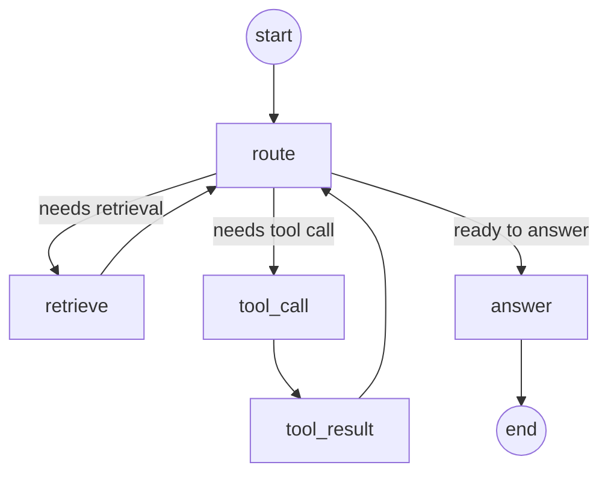

# FellowshipChat

**A production-shaped chat platform where humans, groups, and AI agents share one interface — built week by week, layer by layer, until the whole stack composes into a single product.**

> React · NestJS · MongoDB Atlas · LangGraph · RAG · SSE streaming

---

## What this is

FellowshipChat is the capstone of an eight-week, AI-native engineering fellowship. It is not a tutorial clone or a weekend hack. It is a **full-stack chat application** with real auth, real persistence, real media delivery, and a **LangGraph agent** that powers both a general-purpose assistant ("Maxwell") and per-user **RAG tutors** grounded in uploaded documents — all in one polished UI.

The thesis: disciplined layering makes a system cheap to extend. Week 2 defined the HTTP contract. Week 4 enforced `Controller → Orchestrator → Service → Repository`. Week 6 added LLM streaming behind orchestrators. Week 7 added vector retrieval. Week 8 swapped the reply engine for a checkpointed state graph — **without changing the public API surface**.


---

## Highlights

| Capability | Detail |
|---|---|
| **Four conversation modes** | Direct messages, group chats, Maxwell assistant, and custom RAG tutors — one sidebar, one message panel |
| **LangGraph agent** | Explicit state graph with conditional routing: retrieve → tool call → answer |
| **MongoDB checkpointing** | Agent state survives server restarts; conversations resume mid-turn |
| **RAG knowledge base** | Upload `.txt` / `.md` → chunk → embed → Atlas Vector Search → cited answers |
| **SSE streaming** | Token deltas, tool-call progress, and terminal citations over Server-Sent Events |
| **User-scoped tools** | `retrieve_docs` and `summarize_my_recent_messages` — authorization enforced at the service layer, not trusted to the model |
| **Media pipeline** | Presigned S3 uploads, CloudFront delivery for avatars (profile, groups, tutors) |
| **Strict TypeScript** | No `any`. Typed API contract. 200+ automated tests across frontend and backend |

---

## Architecture

```
┌─────────────────────────────────────────────────────────────────────────┐
│  Browser — React 19 + TypeScript + Tailwind CSS v4 + Vite              │
│  ┌──────────────┐  ┌──────────────┐  ┌──────────────┐  ┌────────────┐ │
│  │ Auth         │  │ Conversations│  │ Messages     │  │ Knowledge    │ │
│  │ (JWT)        │  │ (4 types)    │  │ (optimistic) │  │ Panel (RAG)  │ │
│  └──────┬───────┘  └──────┬───────┘  └──────┬───────┘  └──────┬─────┘ │
│         │                 │                  │                  │       │
│         └─────────────────┴──────────────────┴──────────────────┘       │
│                                    │ apiClient + SSE                    │
└────────────────────────────────────┼────────────────────────────────────┘
                                     │  /api → :3001 (Vite proxy)
┌────────────────────────────────────┼────────────────────────────────────┐
│  NestJS API                        ▼                                    │
│  ┌──────────────────────────────────────────────────────────────────┐ │
│  │ Controller  →  Orchestrator  →  Service  →  Repository  →  DB   │ │
│  └──────────────────────────────────────────────────────────────────┘ │
│         │                              │                                │
│         │         ┌────────────────────┴────────────────────┐          │
│         │         │  LangGraph Agent (assistant + tutor)   │          │
│         │         │  route → retrieve | tool_call → answer │          │
│         │         │  MongoDBSaver (thread_id = conv id)    │          │
│         │         └────────────────────────────────────────┘          │
│         ▼                              ▼                                │
│  ┌─────────────┐              ┌─────────────────┐                      │
│  │ MongoDB     │              │ OpenAI          │                      │
│  │ Atlas       │              │ gpt-4o-mini +   │                      │
│  │ (documents, │              │ embeddings      │                      │
│  │  vectors,   │              └─────────────────┘                      │
│  │  checkpoints)│                                                       │
│  └─────────────┘              ┌─────────────────┐                      │
│                               │ AWS S3 +        │                      │
│                               │ CloudFront      │                      │
│                               └─────────────────┘                      │
└─────────────────────────────────────────────────────────────────────────┘
```

### The agent graph

Both `assistant` and `tutor` conversations route through a single compiled `StateGraph`. Request identity (`userId`, `conversationId`, `mode`) travels in `config.configurable` — never in agent state — so the model cannot widen authorization scope.



**State schema** (evolving data only):

```ts
const AgentState = Annotation.Root({
  messages:        Annotation<BaseMessage[]>({ reducer: messagesStateReducer }),
  retrievedChunks: Annotation<RetrievedChunk[]>({ reducer: (_, u) => u }),
  citations:       Annotation<Citation[]>({ reducer: (_, u) => u }),
  lastToolCall:    Annotation<ToolCallInfo | null>({ reducer: (_, u) => u }),
})
```

**Tools** (both reuse existing domain services):

| Tool | Purpose | Scope |
|---|---|---|
| `retrieve_docs` | Vector search over uploaded documents | `userId` + `tutorId` |
| `summarize_my_recent_messages` | Summarize the user's recent chat activity | `userId` |

**Streaming contract** (`GET /conversations/:id/assistant`, SSE):

| Event | Payload | UX |
|---|---|---|
| `delta` | `{ text }` | Tokens appear progressively |
| `tool_call` | `{ id, name }` | "Searching your documents…" |
| `tool_result` | `{ id, name }` | Tool finished |
| `done` | `{ messageId, citations }` | Persisted reply + source citations |
| `error` | `{ code }` | Terminal failure |

---

## Eight-week journey

| Week | Layer | What shipped |
|:---:|---|---|
| 1–2 | **Frontend foundation** | React app, typed API client, auth screens, conversation sidebar, message panel with optimistic sends |
| 3 | **Contract-first design** | `API_CONTRACT.md` — the single source of truth for every endpoint shape |
| 4 | **Backend** | NestJS + MongoDB, JWT auth, strict `Controller → Orchestrator → Service → Repository` stack |
| 5 | **Groups & profiles** | Group chats, user profiles, presigned S3 avatar uploads via CloudFront |
| 6 | **AI assistant** | Maxwell — SSE streaming, tool loop, `summarize_my_recent_messages` |
| 7 | **RAG tutor** | Document ingestion, chunking, embeddings, Atlas Vector Search, cited tutor replies |
| 8 | **Capstone agent** | Unified LangGraph agent, MongoDB checkpointing, tool-progress streaming, one code path for assistant + tutor |

Each week added a layer. None of them were thrown away — they composed.

---

## Features

### Messaging
- Conversation list with search, pin/unpin, unread counts, and skeleton loading states
- Cursor-paginated message history (newest-first fetch, oldest→newest display)
- Optimistic send with rollback on failure
- Auto-scroll and empty/error states

### Conversations
- **Direct** — one-to-one between two users
- **Group** — named groups with custom avatars and participant management
- **Assistant** — Maxwell, the built-in AI helper with access to your recent messages
- **Tutor** — user-created, document-grounded tutors with a dedicated knowledge panel

### Knowledge base (RAG)
- Upload `.txt` or `.md` documents (up to 1 MB per file)
- Synchronous ingestion: split → embed (`text-embedding-3-small`) → store in Atlas Vector Search
- Per-tutor document list with delete
- Tutor answers include inline citations linking back to source chunks

### Auth & profiles
- Email + password signup/login with bcrypt hashing
- JWT stored client-side; session restored via `GET /me` on refresh
- Profile editing (name, email) and avatar upload
- Automatic redirect to login on 401

---

## Stack

| Layer | Technologies |
|---|---|
| **Frontend** | React 19, TypeScript, Tailwind CSS v4, Vite, Vitest, Testing Library |
| **Backend** | NestJS 11, Mongoose, Passport JWT, class-validator, Zod env validation |
| **Database** | MongoDB Atlas (documents + Vector Search index) |
| **AI** | LangGraph, LangChain, OpenAI (`gpt-4o-mini`, `text-embedding-3-small`) |
| **Agent persistence** | `@langchain/langgraph-checkpoint-mongodb` (`MongoDBSaver`) |
| **Media** | AWS S3 (presigned POST), CloudFront CDN |
| **Streaming** | Server-Sent Events via NestJS `@Sse()` |

---

## Project structure

```
chat-mvp/
├── src/                          # React frontend (feature-sliced)
│   ├── api/                      # HTTP client, SSE helpers, shared types
│   └── features/
│       ├── auth/                 # Login, signup, session
│       ├── conversations/        # Sidebar, search, new-menu, tutors, knowledge panel
│       ├── messages/             # Bubbles, composer, agent progress, citations
│       ├── profile/              # Profile screen, avatar upload
│       ├── user/                 # User directory, avatars
│       └── app/                  # Layout, toast, navigation
├── backend/
│   └── src/modules/
│       ├── controllers/          # All HTTP controllers (one module)
│       ├── *-orchestrator/       # One orchestrator per endpoint (~30)
│       ├── agent/                # LangGraph graph, nodes, tools, checkpointer
│       ├── knowledge/            # Vector search, chunk storage
│       ├── embedding/            # OpenAI embedding provider
│       ├── chat-model/           # OpenAI chat model provider
│       ├── conversations/        # Domain: conversations
│       ├── messages/             # Domain: messages
│       ├── users/                # Domain: users
│       ├── auth/                 # Domain: auth
│       └── documents/            # Domain: knowledge documents
├── API_CONTRACT.md               # HTTP contract (source of truth)
├── docs/
│   ├── CONVENTIONS.md            # Architecture rules (mentor-reviewed)
│   └── spec.md                   # Current week feature spec
└── README.md
```

### Backend layering (non-negotiable)

Every endpoint follows the same vertical slice:

```
Controller  →  extract HTTP context, call orchestrator.execute(), return
Orchestrator →  compose services, run transactions, map domain → wire
Service     →  business logic + authorization for one domain
Repository  →  Mongoose queries only
```

Orchestrators never call repositories. Services never call each other. Controllers never hold business logic. See [`docs/CONVENTIONS.md`](docs/CONVENTIONS.md) for the full rulebook.

---

## Run locally

### Prerequisites

- Node.js 20+
- **MongoDB Atlas** cluster with Vector Search enabled (`mongodb+srv://…`) — local MongoDB does not support vector search
- OpenAI API key
- AWS credentials + S3 bucket + CloudFront distribution (for avatar uploads)

### 1. Backend

```bash
cd backend
cp .env.example .env
```

Set in `.env`:

| Variable | Purpose |
|---|---|
| `MONGO_URI` | Atlas connection string |
| `OPENAI_API_KEY` | Chat + embeddings |
| `JWT_SECRET` | Token signing (32+ chars) |
| `AWS_*` + `AVATAR_*` | S3 presigned uploads + CloudFront base URL |

```bash
npm install
npm run atlas:index    # create Vector Search index (once per cluster)
npm run start:dev      # → http://localhost:3001
```

### 2. Frontend

```bash
npm install
npm run dev            # → http://localhost:5173
```

The Vite dev server proxies `/api` to the backend.

### 3. Verify

```bash
# Frontend
npx tsc --noEmit && npm test

# Backend
cd backend && npx tsc --noEmit && npm test
```

---

## Testing

| Suite | Runner | Scope |
|---|---|---|
| Frontend unit | Vitest + Testing Library | Components, hooks, reducers, SSE helpers |
| Backend unit | Jest | Orchestrators, services, agent nodes, mappers |
| Backend integration | Jest | Agent checkpoint resume, user flows |
| Backend e2e | Jest + supertest | Full HTTP journey tests |

```bash
npm test                              # frontend
cd backend && npm test                # backend unit
cd backend && npm run test:e2e        # backend e2e + integration
cd backend && npm run eval:rag        # RAG quality eval harness
```

---

## API

Every endpoint, request shape, response shape, and error code is documented in [`API_CONTRACT.md`](API_CONTRACT.md).

Key endpoints:

| Method | Path | Purpose |
|---|---|---|
| `POST` | `/auth/signup` · `/auth/login` | Create account / authenticate |
| `GET` | `/me` | Restore session |
| `GET` | `/conversations` | List conversations (search, pin) |
| `POST` | `/conversations` | Create direct / group / assistant / tutor |
| `GET` | `/conversations/:id/messages` | Paginated messages |
| `POST` | `/conversations/:id/messages` | Send a message |
| `GET` | `/conversations/:id/assistant` | SSE agent reply stream |
| `POST` | `/knowledge/documents` | Upload + ingest a document |
| `GET` | `/knowledge/documents` | List documents for a tutor |
| `DELETE` | `/knowledge/documents/:id` | Remove document + chunks |

---

## Security model

- All endpoints require `Authorization: Bearer <token>` except signup and login
- Tools and vector search are scoped to the authenticated `userId` at the service/repository layer
- Agent request identity (`userId`, `conversationId`) is injected via LangGraph `config.configurable` — the model cannot override it
- Vector search queries include a `userId` + `tutorId` filter in the `$vectorSearch` pipeline
- Secrets live in environment variables only; validated at boot with Zod
- Passwords hashed with bcrypt; JWTs expire (default 1h)

---

## Design principles

1. **Contract first** — the API shape was designed in Week 2 and evolved through a changelog, not ad-hoc patches
2. **One responsibility per file** — ~150 line soft cap; split at logical boundaries
3. **Orchestrators compose, services don't** — the only place that crosses domain boundaries
4. **Store identity, derive presentation** — MongoDB holds facts; mappers shape wire types
5. **Treat the LLM as an untrusted function** — authorization is never delegated to the model
6. **Layering enables composition** — Week 8 replaced the reply engine without touching controllers, services, or the HTTP contract

---

## License

Private — built as part of the Masterschool AI-native engineering fellowship.

