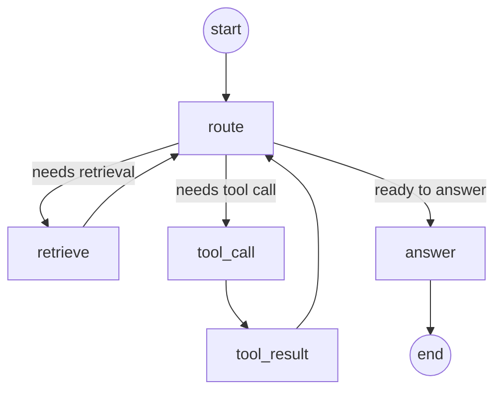

# Week 8 Capstone — Full Integrated AI Chat MVP (LangGraph Agent)

Refactors the Week 7 tutor and the Week 6 assistant into a **single LangGraph agent** that
routes between retrieval, a user-data tool, and answering; persists its state in MongoDB via
the LangGraph checkpoint saver; and streams token deltas plus tool progress to the React UI.
All three conversation types (human, assistant, tutor) work in one UI.

## Setup checklist (runs locally, end to end)

1. **MongoDB Atlas** (required — local Mongo has no Vector Search). Set `MONGO_URI` in
   `backend/.env` (see `backend/.env.example`). The agent checkpoint collections
   (`agent_checkpoints`, `agent_checkpoint_writes`) are created automatically on boot; no
   new env vars beyond Week 7.
2. **OpenAI**: `OPENAI_API_KEY` (chat model `gpt-4o-mini`, embeddings `text-embedding-3-small`).
3. **Vector index** (one time): `cd backend && npm run atlas:index`.
4. **Backend**: `cd backend && npm install && npm run start:dev` (`:3001`).
5. **Frontend**: `npm install && npm run dev`.
6. **Checks**: `cd backend && npx tsc --noEmit && npm test`; root `npx tsc --noEmit && npm test`.

## Agent graph



- **route** — `ChatOpenAI.bindTools([...])`, invoked non-streaming; its tool calls drive the
  one conditional edge (`decideNext`): `retrieve_docs` → `retrieve`, a user-data tool →
  `tool_call`, no tool calls → `answer`.
- **retrieve** — embeds the query, calls `KnowledgeService.search`, fills `retrievedChunks`
  + `citations`, appends the context as a `ToolMessage`.
- **tool_call → tool_result** — announces the user-data tool, then executes it via a LangGraph
  `ToolNode`.
- **answer** — the only streamed node; streams tokens through LangGraph's custom writer.
  Tutor mode uses the grounding prompt (+ retrieved context, cites `[k]`); assistant mode uses
  the Maxwell prompt.

## Agent state schema (Annotation)

```ts
const AgentState = Annotation.Root({
  ...MessagesAnnotation.spec,                 // conversation history (BaseMessage[])
  retrievedChunks: Annotation<RetrievedChunk[]>({ reducer: (_, u) => u, default: () => [] }),
  citations:       Annotation<Citation[]>({ reducer: (_, u) => u, default: () => [] }),
  lastToolCall:    Annotation<ToolCallInfo | null>({ reducer: (_, u) => u, default: () => null }),
})
```

Request identity — `userId`, `conversationId`, `mode` (`assistant | tutor`) — travels in
`config.configurable`, never in agent state, so the model cannot widen the authorization scope.

## Tools (scoped to the authenticated user)

| Tool | Backs onto | Scope | Progress label |
|---|---|---|---|
| `retrieve_docs` | `EmbeddingProvider.embed` + `KnowledgeService.search` (`$vectorSearch` filtered by `userId` + `tutorId`) | `userId`, `tutorId = conversationId` | "Searching your documents…" |
| `summarize_my_recent_messages` | `MessagesService.findRecentBySender` (reused from Week 6) | `userId` | "Looking up your messages…" |

## Streaming event contract (SSE)

`delta { text }` · `tool_call { id, name }` · `tool_result { id, name }` ·
`done { messageId, citations }` · `error { code }`. Display labels for tool names live in an FE
constants map. See `API_CONTRACT.md`.

## MongoDB checkpointing / resume

- `MongoDBSaver` from `@langchain/langgraph-checkpoint-mongodb`, `thread_id = conversationId`.
- Uses a dedicated `mongodb@6` client (Mongoose is on `mongodb@7`; the major-version split
  makes reusing its client a type clash), sharing the same `MONGO_URI`.
- **Test it:** start a tutor chat, ask a question, kill the backend mid-answer, restart, and
  ask a follow-up — the conversation continues from the checkpoint. Automated proof:
  `test/integration/agent-checkpoint.int-spec.ts` (a fresh client + saver resumes accumulated
  state on the same `thread_id`; a different thread starts clean).

## Tradeoffs / decisions

- **Unified agent** (assistant + tutor) instead of a tutor-only agent: retires the hand-rolled
  Week 6 tool loop, so there is one tool mechanism and one streaming path. The `ai-assistant`
  `LlmProvider` stack and both old streaming orchestrators were deleted.
- **Separate `answer` node** (vs. streaming from `route`): matches the spec's node list and the
  taught decide→answer model. Cost: on the final turn `route` produces a discarded decision
  generation — one short `gpt-4o-mini` call; only `answer` streams to the client.
- **`ToolNode` for the user-data tool** (the course's taught pattern); `retrieve` stays a custom
  node because it must surface structured citations into state.
- Provider stays **OpenAI** behind the existing `ChatModelProvider`/`EmbeddingProvider`
  abstractions — no provider switch, matching the surrounding code.

## Eight-week reflection

The capstone was mostly composition, not new invention — because every prior week held the
layer boundaries. The Week 2 API contract and the strict `Controller → Orchestrator → Service →
Repository` stack (Weeks 3–5) meant the agent could reuse `KnowledgeService` and
`MessagesService` unchanged, with the same per-user authorization. Week 6 established the
"LLM as an untrusted function" discipline (parse → validate → authz → act) and the SSE-behind-an-
orchestrator pattern; Week 7 added retrieval as a user-scoped query and citations as part of the
contract. Week 8 only had to swap the reply *engine*: a LangGraph state graph replaced the
hand-rolled loop, MongoDB checkpointing replaced implicit per-request state, and two SSE events
were added — while the controller stayed a one-liner and the tools reused the same services.
The biggest lesson: disciplined layering is what makes a system composable later.

## Demo notes

- **Human** conversation: normal messaging (no agent).
- **Assistant** (Maxwell): ask "summarize my recent messages" → "Looking up your messages…"
  progress → streamed answer.
- **Tutor**: upload a doc, ask about it → "Searching your documents…" → streamed grounded
  answer with a **Sources** citations list. Ask something off-topic → it declines to answer
  from outside the documents.
- **Resume**: kill the backend mid-answer, restart, continue — state resumes from the checkpoint.

## Verification

- Backend: `npx tsc --noEmit` clean; `npm test` green (unit) + the checkpoint integration test.
- Frontend: `npx tsc --noEmit` clean; `npm test` green (incl. reducer tool-activity + AgentProgress).
