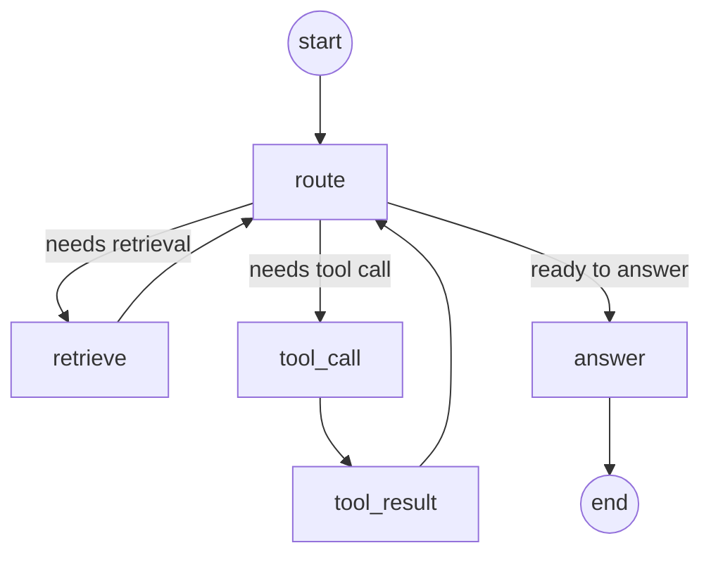

# Week 8 Capstone — Unified LangGraph Agent (Design)

Status: approved 2026-07-08. Governs the refactor of the Week 7 tutor + Week 6 assistant
into a single LangGraph agent, with MongoDB checkpointing and streamed agent events.

## Decisions

- **Unified agent.** One compiled `StateGraph` serves both `assistant` and `tutor`
  conversations. The hand-rolled OpenAI tool loop (`stream-assistant-reply-orchestrator`)
  and the tutor RAG chain (`stream-tutor-reply-orchestrator`) are both retired.
- **One model path.** `ChatModelProvider` (`ChatOpenAI`) with `.bindTools(...)`. The raw
  `LlmProvider`/`OpenAIProvider` streaming stack is retired. Provider stays OpenAI.
- **Tools.** `retrieve_docs` (RAG) + `summarize_my_recent_messages` (reused Week 6 tool).
- **Persistence.** LangGraph `MongoDBSaver`, `thread_id = conversationId`. The checkpointer
  owns a dedicated `mongodb@6` `MongoClient` (Mongoose is on `mongodb@7`; the major-version
  split makes reusing its client a TS type clash), sharing the same `MONGO_URI`.

## Architecture

- Router (`stream-reply-router-orchestrator`) still dispatches by `conversation.type`:
  `assistant`/`tutor` -> `StreamAgentReplyOrchestrator`; other types -> `CONVERSATION_NOT_FOUND`.
- Controller `GET /conversations/:id/assistant` (`@Sse()`) unchanged.
- The graph is compiled once (singleton) with the checkpointer + injected services.
  Request identity (`userId`, `conversationId`, `mode`) travels in `config.configurable`,
  never in graph state, so the model cannot widen the authorization scope.

## Agent state (Annotation)

```ts
const AgentState = Annotation.Root({
  messages:        Annotation<BaseMessage[]>({ reducer: messagesStateReducer, default: () => [] }),
  retrievedChunks: Annotation<RetrievedChunk[]>({ reducer: (_, u) => u, default: () => [] }),
  citations:       Annotation<Citation[]>({ reducer: (_, u) => u, default: () => [] }),
  lastToolCall:    Annotation<ToolCallInfo | null>({ reducer: (_, u) => u, default: () => null }),
})
```

## Graph



- `route` — `chatModel.bindTools([retrieve_docs, summarize_my_recent_messages])`, non-streaming.
- `decideNext(state)` — pure predicate: `retrieve_docs` tool_call -> `retrieve`; user-data
  tool_call -> `tool_call`; no tool_calls -> `answer`.
- `retrieve` — embed query -> `KnowledgeService.search` -> fill `retrievedChunks`+`citations`.
- `tool_call` -> `tool_result` — announce, then execute the user-data tool (user-scoped).
- `answer` — the only streamed node; tutor grounding prompt vs Maxwell assistant prompt by mode.

Tradeoff: on the final turn `route` produces a discarded decision generation; only `answer`
streams to the client (filtered by `langgraph_node === 'answer'`). One short gpt-4o-mini call.

## Tools

| Tool | Wraps | Scope | Label |
|---|---|---|---|
| `retrieve_docs` | `EmbeddingProvider.embed` + `KnowledgeService.search` | `userId`, `tutorId = conversationId` | Searching your documents… |
| `summarize_my_recent_messages` | `MessagesService.findRecentBySender` | `userId` | Looking up your messages… |

## Streaming event contract (SSE, additive)

| Event | Payload | Source |
|---|---|---|
| `delta` | `{ text }` | `answer` tokens |
| `tool_call` | `{ id, name }` | `route` tool_calls |
| `tool_result` | `{ id, name }` | `retrieve` / `tool_result` done |
| `done` | `{ messageId, citations }` | end |
| `error` | `{ code }` | failure |

Display labels live in an FE constants map keyed by tool `name`.

## Persistence model

- LangGraph checkpoints = agent working memory (enables mid-conversation resume).
- `messages` collection = user-facing transcript (unchanged; still the UI source of truth).
  The `answer` node's final text is persisted via `TransactionRunner` + `done`.

## Slices

1. Deps + `MongoDBSaver` provider + compiled state-only graph.
2. Nodes + edges + tools; graph runs end-to-end via a script.
3. `StreamAgentReplyOrchestrator` + router rewire + SSE event mapping.
4. FE: `AgentEvent` union + tool-activity reducer + `AgentProgress` component.
5. Retire dead orchestrators/provider + PR docs (diagram, schema, tools, reflection, setup).

## Verification

- BE units: `decideNext` predicate, node behavior with mocked services, SSE mappers,
  orchestrator spec (mocked graph), scripted checkpoint-resume test.
- FE units: tool-activity reducer, `AgentProgress` component, stream dispatch.
- `npx tsc --noEmit` + tests both sides. Manual demo checklist in the PR.
